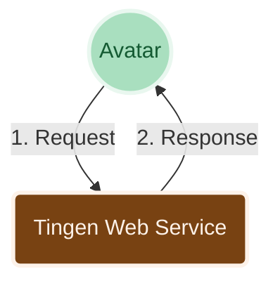

  <picture>
    <source media="(prefers-color-scheme: dark)" srcset=".github/repository/logo/Tingen-WebService-CommunityRelease-Logo-Trans-ForDark-512x346.png">
    <source media="(prefers-color-scheme: light)" srcset=".github/repository/logo/Tingen-WebService-CommunityRelease-Logo-Trans-ForLight-512x346.png">
    
  </picture>
  
  <h3>The Community Release of the Tingen Web Service</h3>

  &nbsp;
  &nbsp;
  

***

<h6 align="center">

  [MANUAL](https://github.com/spectrum-health-systems/Tingen-WebService/blob/R26.5/docs/man/README.md)&nbsp;&bull;&nbsp;[CHANGELOG](https://github.com/spectrum-health-systems/Tingen-WebService/blob/R26.5/docs/CHANGELOG.md)&nbsp;&bull;&nbsp;[ROADMAP](https://github.com/spectrum-health-systems/Tingen-WebService/blob/development/docs/ROADMAP.md)&nbsp;&bull;&nbsp;[KNOWN ISSUES](https://github.com/spectrum-health-systems/Tingen-WebService/blob/R26.5/docs/KNOWN-ISSUES.md)
  
</h6>

***

| CONTENTS                                                      |
|:------------------------------------------------------------- |
| [ABOUT THE TINGEN WEB SERVICE](#about-the-tingen-web-service) |
| [FEATURES](#features)                                         |
| [HOW IT WORKS](#how-it-works)                                 |
| [GETTING STARTED](#getting-started)                           |
| [BUILT WITH](#built-with)                                     |
| [RELATED PROJECTS](#related-projects)                         |
| [LICENSE](#license)                                           |

***

## ABOUT THE TINGEN WEB SERVICE

Netsmart's [AvatarNX™ EHR](https://www.ntst.com/Solutions-and-Services/Offerings/myAvatar) is a behavioral health Electronic Health Records application that offers a recovery-focused suite of solutions that leverage real-time analytics and clinical decision support to drive value-based care.

While AvatarNX™ is a robust platform, it isn't perfect. The good news is that you can extend AvatarNX™ functionality via [Netsmart's Web Services](URL), and/or custom web services that are written by other AvatarNX™ users.

The **Tingen Web Service** is one such custom web service which includes various tools and utilities for AvatarNX™ that aren't included in the official release, and provides a solid foundation for building additional functionality quickly and efficiently.

## FEATURES

* Several built-in tools and utilities that extend the functionality of AvatarNX™
* A solid foundation to build additional AvatarNX™ custom tools and utilities
* Extremely customizable
* Robust logging
* ...and more!

## HOW IT WORKS

A very high level overview of how the Tingen Web Service works:

1. Avatar sends an `OptionObject` and a `ScriptParameter` to the Tingen Web Service
2. The Tingen Web Service processes the request and returns a modified `OptionObject` back to Avatar

## GETTING STARTED

### Requirements

You can find all of the information you need to install and use the Tingen Web Service in the [Tingen Web Service Manual](docs/man/README.md).

If you are interested in contributing to the development of the Tingen Web Service, or are just curious about how it works under the hood, please check out the [Development Manual](docs/man/dev/README.md) and/or the [API documentation](https://spectrum-health-systems.github.io/Tingen-WebService/api/html/Welcome.htm).

## BUILT WITH

* [.NET Framework 4.8](https://dotnet.microsoft.com/en-us/download/dotnet-framework/net48)
* [ScriptLink Standard](https://rcskids.github.io/ScriptLinkStandard/) - A class library for creating SOAP web services [AvatarNX™](https://www.ntst.com/Solutions-and-Services/Offerings/myAvatar)
* [Sandcastle Help File Builder](https://github.com/EWSoftware/SHFB)  - Documentation generation

## RELATED PROJECTS

* [Tingen Transmorger](https://github.com/spectrum-health-systems/Tingen-Transmorger) - Utilities for Netsmart's AvatarNX™ TeleHealth platform
* [The Unofficial AvatarNX Runbook](https://github.com/spectrum-health-systems/The-Unofficial-AvartarNX-Runbook) - A collection of tips, tricks, and best practices for working with AvatarNX™

## LICENSE

Distributed under the [Apache 2.0 License](LICENSE)  
Copyright &copy; 2026 [A Pretty Cool Program](https://github.com/APrettyCoolProgram)

***

<h6 align="center">

  [FAQ](https://github.com/spectrum-health-systems/Tingen-WebService/blob/R26.5/docs/FAQs.md)&nbsp;&bull;&nbsp;[DEVELOPMENT](https://github.com/spectrum-health-systems/Tingen-WebService/blob/development/docs/DEVELOPMENT.md)&nbsp;&bull;&nbsp;[API](https://spectrum-health-systems.github.io/Tingen-WebService/api/html/Welcome.htm)&nbsp;&bull;&nbsp;[TESTING](https://github.com/spectrum-health-systems/Tingen-WebService/blob/R26.5/docs/TESTING.md)&nbsp;&bull;&nbsp;[SUPPORT](https://github.com/spectrum-health-systems/Tingen-WebService/blob/development/docs/SUPPORT.md)&nbsp;&bull;&nbsp;[NOTICES](https://github.com/spectrum-health-systems/Tingen-WebService/blob/R26.5/docs/NOTICES.md)
  
</h6>

  
  
  &nbsp;&nbsp;
  &nbsp;&nbsp;
  &nbsp;&nbsp;
  &nbsp;&nbsp;

# About the Tingen Community Release

[Tingen](https://github.com/spectrum-health-systems/Tingen) is a custom web service for Netsmart's Avatar EHR.

The Tingen Community Release is:

* The **stable, tested** version of Tingen!
* **Intended** to be used in production environments!
* Has beautiful code*! Like **poetry**!
* For use by the Avatar Community!

# Repository branches

There are three types of branches in this repository:

* **[main](https://github.com/spectrum-health-systems/Tingen_development/tree/main)**  
  This is the current Tingen Community Release.
  
  Feel free to use it in your production environments.
  
* **Community Release archive snapshots**  
  When development starts on a new monthly version, the previous version is archived to a separate branch (e.g., `24.9.0-CommunityRelease`).

# Documentation

You can find all the documentation you could ever want about Tingen (and related projects) [here](https://github.com/spectrum-health-systems/Tingen-Documentation).

* Not really, but I think it's nice.
