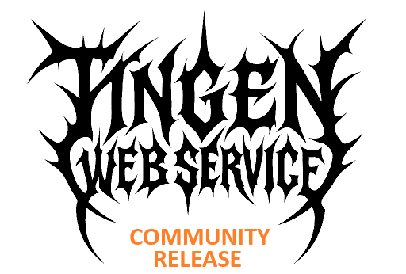

  <picture>
    <source media="(prefers-color-scheme: dark)" srcset=".github/repository/logo/Tingen-WebService-CommunityRelease-Logo-Trans-ForDark-512x346.png">
    <source media="(prefers-color-scheme: light)" srcset=".github/repository/logo/Tingen-WebService-CommunityRelease-Logo-Trans-ForLight-512x346.png">
    
  </picture>
  
  <h3>The Community Release of the Tingen Web Service</h3>

  &nbsp;
  &nbsp;
  

***

<h6 align="center">

  [MANUAL](https://github.com/spectrum-health-systems/Tingen-WebService/blob/R26.5/docs/man/README.md)&nbsp;&bull;&nbsp;[CHANGELOG](https://github.com/spectrum-health-systems/Tingen-WebService/blob/R26.5/docs/CHANGELOG.md)&nbsp;&bull;&nbsp;[ROADMAP](https://github.com/spectrum-health-systems/Tingen-WebService/blob/development/docs/ROADMAP.md)&nbsp;&bull;&nbsp;[KNOWN ISSUES](https://github.com/spectrum-health-systems/Tingen-WebService/blob/R26.5/docs/KNOWN-ISSUES.md)
  
</h6>

***

The Tingen Web Service **Community Release** is a stable, tested version of the [R26.5](https://github.com/spectrum-health-systems/Tingen-WebService/tree/R26.5) [Tingen Web Service](https://github.com/spectrum-health-systems/Tingen-WebService), and is intended to be used in production environments by the Avatar Community.

The Community Release is based on [R26.5](https://github.com/spectrum-health-systems/Tingen-WebService/tree/R26.5) of the Tingen Web Service, which is based on the R26.5 release of the AvatarNX™ platform. It includes all of the features and functionality of the Tingen Web Service, as well as several additional tools and utilities that are not included in the standard release.

* Several built-in tools and utilities that extend the functionality of AvatarNX™
* A solid foundation to build additional AvatarNX™ custom tools and utilities
* Extremely customizable
* Robust logging
* ...and more!

## LICENSE

Distributed under the [Apache 2.0 License](LICENSE)  
Copyright &copy; 2026 [A Pretty Cool Program](https://github.com/APrettyCoolProgram)

***

<h6 align="center">

  [FAQ](https://github.com/spectrum-health-systems/Tingen-WebService/blob/R26.5/docs/FAQs.md)&nbsp;&bull;&nbsp;[DEVELOPMENT](https://github.com/spectrum-health-systems/Tingen-WebService/blob/development/docs/DEVELOPMENT.md)&nbsp;&bull;&nbsp;[API](https://spectrum-health-systems.github.io/Tingen-WebService/api/html/Welcome.htm)&nbsp;&bull;&nbsp;[TESTING](https://github.com/spectrum-health-systems/Tingen-WebService/blob/R26.5/docs/TESTING.md)&nbsp;&bull;&nbsp;[SUPPORT](https://github.com/spectrum-health-systems/Tingen-WebService/blob/development/docs/SUPPORT.md)&nbsp;&bull;&nbsp;[NOTICES](https://github.com/spectrum-health-systems/Tingen-WebService/blob/R26.5/docs/NOTICES.md)
  
</h6>

***

Last updated: 260618
